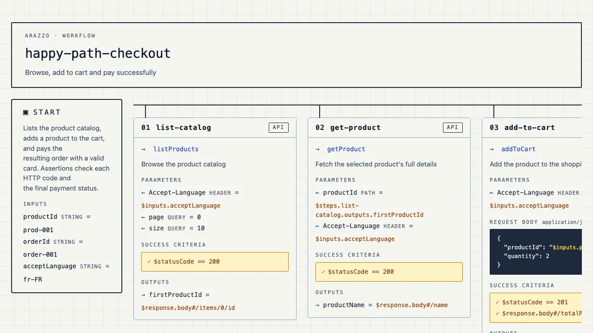
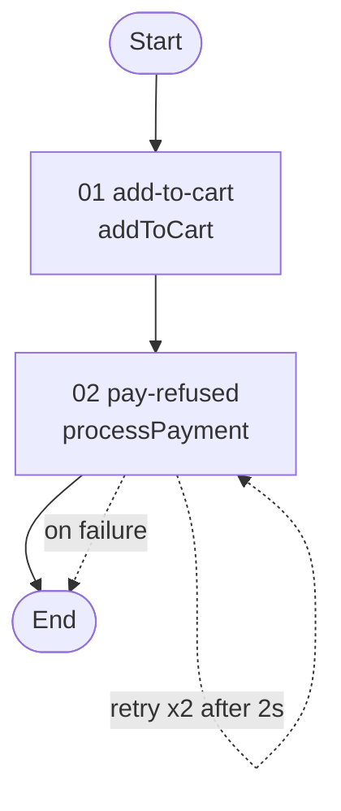

<!--
  Repo: https://github.com/emmanuelperu/arazzo-maestro

  Some badges may resolve only after one-time setup:
  - Codecov / Go Report Card: need a one-time sign-in on those services.
  - Docker image: published at `ghcr.io/emmanuelperu/arazzo-maestro` (tagged per release, plus `:latest`); can also be built locally via `docker build --build-arg VERSION=<x.y.z> -t arazzo-maestro:<x.y.z> .` (see the Docker recipe in docs/RECIPES.md).
-->

<p align="center">
  
</p>

<h1 align="center">arazzo-maestro</h1>

<p align="center">
  <strong>Lint &amp; render Arazzo workflows. Single Go binary. Eco-designed. Accessible by default.</strong>
</p>

<p align="center">
  <a href="https://github.com/emmanuelperu/arazzo-maestro/actions/workflows/ci.yml"></a>
  <a href="https://codecov.io/gh/emmanuelperu/arazzo-maestro"></a>
  <a href="https://goreportcard.com/report/github.com/emmanuelperu/arazzo-maestro"></a>
  <a href="https://pkg.go.dev/github.com/emmanuelperu/arazzo-maestro"></a>
  <a href="https://github.com/emmanuelperu/arazzo-maestro/releases"></a>
  <a href="https://github.com/emmanuelperu/arazzo-maestro/pkgs/container/arazzo-maestro"></a>
</p>

<p align="center">
  <a href="https://go.dev/dl/"></a>
  <a href="./LICENSE"></a>
  <a href="./docs/SPEC_COMPLIANCE.md"></a>
  <a href="./.agents/rules/accessibility.md"></a>
  <a href="./.agents/rules/eco-design.md"></a>
  <a href="https://www.bestpractices.dev/projects/12929"></a>
  <a href="https://scorecard.dev/viewer/?uri=github.com/emmanuelperu/arazzo-maestro"></a>
</p>

<p align="center">
  <a href="https://github.com/emmanuelperu/arazzo-maestro/stargazers"></a>
  &nbsp;
  <a href="https://github.com/emmanuelperu/arazzo-maestro/commits/main"></a>
  <a href="https://github.com/emmanuelperu/arazzo-maestro/issues"></a>
  <a href="https://github.com/emmanuelperu/arazzo-maestro/pulls"></a>
</p>

---

## What it does

`arazzo-maestro` is a CLI that turns [Arazzo](https://spec.openapis.org/arazzo/latest.html) workflow specifications into something useful for the rest of your team:

- **`lint`**: validate Arazzo files against the official JSON Schema, internal semantic rules (unique IDs, `$steps` references), and cross-file checks against the referenced OpenAPI contracts.
- **`view`**: generate a standalone HTML page per workflow (or a Mermaid flowchart with `--format mermaid`), no server, no build, no JavaScript framework. Open in any browser, commit to a docs folder, ship to GitHub Pages.
- **`test`**: generate runnable tests from a workflow. End-to-end with `test gen e2e` (Hurl), or generate and run them against an endpoint with an optional HTML report (`test run e2e`); load/performance with `test gen perf` (k6).

```text
*.arazzo.yaml (Arazzo) ────┐                       ┌─►  lint   →  exit 0/1 + structured findings
                           ├──►  arazzo-maestro  ──┼─►  view   →  dist/*.html  (standalone)
*-openapi.yaml / *-api.yaml ┤                       ├─►  test e2e  →  dist/e2e/hurl/*.hurl  (+ run / HTML report)
themes.yml (opt.)        ──┘                       └─►  test perf →  dist/perf/k6/*.k6.js
```

## Why it exists

| Need | What we do | What we don't try to be |
|---|---|---|
| Validate Arazzo files in CI | ✅ Single binary, deterministic, offline. `lint` → exit code + parseable findings | An IDE plugin |
| Share workflows with non-devs | ✅ Standalone HTML, no IDE, no auth | A live editor |
| Cross-file integrity (operationId exists?) | ✅ Reads `sourceDescriptions.url`, indexes operations, validates references | A full OpenAPI validator |
| Turn a workflow into runnable tests | ✅ `test gen/run e2e` emits Hurl files (`{{baseUrl}}`, captures, asserts), runs them, writes an HTML report; `test gen perf` emits k6 scripts | A workflow runtime/orchestrator |
| Eco-designed output | ✅ 1 network request, system fonts, ~23 kB HTML | A pixel-perfect design system |
| Accessibility-first | ✅ WCAG 2.2 AA contrasts, semantic HTML, `aria-hidden` on decoratives | An a11y testing tool |

See ["What makes us different"](#what-makes-us-different) below for the longer take.

## Quick start

```bash
# Install (Go 1.25+)
go install github.com/emmanuelperu/arazzo-maestro/cmd/arazzo-maestro@latest

# Or build the Docker image locally (~19 MB FROM scratch)
docker build --build-arg VERSION=0.0.1 -t arazzo-maestro:0.0.1 .
# Mount cwd into /work AND set it as workdir, so relative paths
# (e.g. examples/shop.arazzo.yaml, dist/) resolve against your host cwd.
docker run --rm -v "$PWD":/work -w /work arazzo-maestro:0.0.1 \
  view examples/shop.arazzo.yaml

# Lint
arazzo-maestro lint examples/shop.arazzo.yaml

# Render every examples/*.arazzo.yaml in light + dark themes
make dist
open dist/shop/light/index.html
```

## Visual preview

The repo ships with three demo Arazzo files in [`examples/`](./examples):

- [`shop.arazzo.yaml`](./examples/shop.arazzo.yaml), happy-path checkout + a retry-on-failure path (showcases `onFailure: retry`). References [`shop-openapi.yaml`](./examples/shop-openapi.yaml) (scored 100/100 by [Vacuum](https://quobix.com/vacuum/)).
- [`checkout-branching.arazzo.yaml`](./examples/checkout-branching.arazzo.yaml), single payment step that branches via `onSuccess: goto` / `onFailure: goto` to a confirm or cancel step. References [`checkout-branching-api.yaml`](./examples/checkout-branching-api.yaml).
- [`auth.arazzo.yaml`](./examples/auth.arazzo.yaml), authenticated scenario showing where test data comes from: credentials as run-time inputs, token captured from the login step, order id self-provisioned from the listing. References [`auth-api.yaml`](./examples/auth-api.yaml) (scored 100/100 by Vacuum).

The `happy-path-checkout` workflow rendered by `view`, in the `light` and `dark` themes (click to enlarge):

| Light | Dark |
|---|---|
| [](./docs/screenshots/happy-light.webp) | [](./docs/screenshots/happy-dark.webp) |

Portrait is the default. `--layout landscape` lays the same workflow out as a horizontal, sideways-scrolling row (START left, steps in between, END right), handy for wide screens and single-slide screenshots:

[](./docs/screenshots/happy-landscape.webp)

`--format mermaid` writes one `.mmd` flowchart per workflow instead of HTML: theme-agnostic text that renders inline on GitHub and in IDEs. Success paths are solid, failure paths dotted, retries loop back. `payment-refused-path` from `shop.arazzo.yaml`:



```bash
# Render every examples/*.arazzo.yaml into dist/<workflow>/{light,dark}/
make dist
```

The Makefile iterates over `examples/*.arazzo.yaml`: adding a new file requires no change to the build command.

> 📂 **Try the HTML output locally**: `make dist` renders every example into `dist/<workflow>/{light,dark}/` (the directory is gitignored).

## Features

### 🔍 Three-pass linter

1. **JSON Schema**: embedded official OAI Arazzo schema (1.0, patched at load to accept 1.0.x **and** 1.1.x). Catches types, required fields, enums, formats, regex.
2. **Semantic rules**: uniqueness of `workflowId` / `stepId`, resolution of `$steps.X.outputs.Y` references, no forward references between steps.
3. **Cross-file**: loads each `sourceDescriptions[].url` from local disk, indexes `operationId`s, validates that every step `operationId` (short form or qualified `$sourceDescriptions.<name>.<op>`) actually points at an operation that exists. HTTP/HTTPS URLs are intentionally refused (offline-first).

```text
$ arazzo-maestro lint examples/shop.arazzo.yaml
OK: examples/shop.arazzo.yaml, no issues found

$ arazzo-maestro lint broken.yaml
[error] arazzo: value does not match expected pattern '^1\.[01]\.\d+(-.+)?$'
[error] workflows[checkout].steps[create-order].operationId:
        operation "createOrder" not found in source "shop-api"
Error: 2 issue(s) found
```

### 🎨 Themes

Three themes ship built-in (`light` default, `dark`, and `pb33f`). All pass WCAG 2.2 AA on all critical colour pairs, verified in tests.

Customise without rebuilding by dropping a `themes.yml` at the root of your project:

```yaml
# themes.yml, change the default with one line
default: dark
```

Or override / extend:

```yaml
default: corporate

themes:
  - name: corporate
    font: serif      # sans | serif | mono (system stacks only)
    shape: square    # rounded | square
    colors:
      bg: "#fafaf7"
      cardBg: "#ffffff"
      runtime: "#7e22ce"
      # …
```

Custom themes that drop below WCAG AA contrast emit warnings at load time. See [`themes.yml.example`](./themes.yml.example) for the full template, and [`internal/theme/themes/builtin.yml`](./internal/theme/themes/builtin.yml) for the reference palette.

### 📋 Arazzo coverage

What works, what degrades, and what is missing, audited field by field
against the official Arazzo 1.1.0 spec: the full, honest matrix lives
in [`docs/SPEC_COMPLIANCE.md`](./docs/SPEC_COMPLIANCE.md) (tracking
issue [#58](https://github.com/emmanuelperu/arazzo-maestro/issues/58)).
The short version:

- **Solid**: the core path: `info`/`sourceDescriptions`/`workflows`,
  steps with `operationId` (short + qualified) or `operationPath`,
  parameters (path/query/header), request bodies with whole-string and
  embedded `{$expr}` substitution and payload replacements, success
  criteria conditions, outputs and capture chaining,
  `onSuccess`/`onFailure` incl. self-retry rendering. Nested
  `step.workflowId` steps render with a workflow tag and link; the
  generators skip them with an explicit not-supported comment.
- **Validated but dropped downstream**: workflow-level
  actions/parameters, `dependsOn`, `components` + Reusable Objects,
  `Criterion.type`/`context`: the official JSON Schema pass accepts
  them, the renderer and generators do not act on them yet.
- **Known non-compliances** (each tracked): `#/json-pointer` suffixes
  on `$inputs`/`$steps` expressions are not translated by the
  generators. The embedded schema is the official **1.0** one with the
  1.1 structural additions (`$self`, `channelPath`, `in: querystring`,
  AsyncAPI sources, expression versions) grafted on at load time, so
  1.1 documents lint; their semantics are not implemented yet.

### 🧪 Test generation

Turn an Arazzo workflow into a runnable test artifact, then run it against any environment. The subcommand grammar names the kind of test first, the target technology second:

```text
arazzo-maestro test gen e2e  <file> [flags]      End-to-end functional tests (Hurl)
arazzo-maestro test run e2e  <file> [flags]      Generate + run them against an endpoint
arazzo-maestro test gen perf <file> [flags]      Load / performance tests (k6)
```

- **`e2e --format=hurl`** (default): one `.hurl` per workflow, every request prefixed with the `{{baseUrl}}` variable so the same file runs against staging, pre-prod or a local mock. `test run e2e` generates and executes them with [Hurl](https://hurl.dev), with an optional HTML report.
- **`perf --format=k6`**: one k6 script per workflow; load profile and thresholds from `--vus` / `--duration` / `--threshold`, target from the `BASE_URL` env var.

Parameters, outputs, success criteria and runtime expressions (including the embedded `{$expr}` form) are translated per format; unresolvable parts degrade to comments rather than guesses, and secrets stay out of the YAML (run-time inputs, captured outputs, self-provisioned data).

📖 Full guide, the Arazzo→Hurl translation table and the test-data model: [`TEST_GENERATION`](./docs/TEST_GENERATION.md).

### 🌱 Eco-design and accessibility

These are **engineering constraints**, not afterthoughts. The rules are formalised in [`.agents/rules/`](./.agents/rules/) and enforced by reviews and tests:

- **Eco-design**: 1 network request at page load (Tailwind CDN), ~23 kB HTML, ~4 kB gzipped, no JavaScript, no fonts loaded from third parties, single Go binary (~19 MB) packaged in a `FROM scratch` Docker image.
- **Accessibility**: WCAG 2.2 AA contrasts (4.5:1 on body text), semantic HTML (`<main>`, `<section>`, `<h1>`→`<h2>`→`<h3>`), `aria-hidden` on decorative icons, visible focus, `prefers-reduced-motion` honoured, no info conveyed by colour alone, fluid `rem` sizing.

### 🧰 Built-in CLI

```text
arazzo-maestro --version                         Print version and exit
arazzo-maestro lint <file>                       Validate against schema + rules + cross-file
arazzo-maestro view <file> [flags]               Render to HTML or Mermaid
arazzo-maestro test gen e2e  <file> [flags]      Generate e2e tests (hurl)
arazzo-maestro test run e2e  <file> [flags]      Generate + run e2e tests, optional HTML report
arazzo-maestro test gen perf <file> [flags]      Generate perf tests (k6)

view flags:
  -o, --output <dir>          Output directory (default: dist)
      --workflow <id>         Only render this workflow
      --no-index              Skip generating index.html
      --theme <name>          Theme (default: light, or themes.yml's default:)
      --themes <path>         Path to a themes YAML (bypasses ./themes.yml)
      --list-themes           List available themes and exit
      --layout <orientation>  Diagram orientation: portrait (default) or landscape
      --format <name>         Output format: html (default) or mermaid (one .mmd flowchart per workflow)

test gen e2e flags:
  -o, --output <dir>          Output directory (default: dist)
      --workflow <id>         Only generate this workflow
      --format <name>         Output format (default: hurl)

test run e2e flags:
      --base-url <url>        Target endpoint, e.g. https://staging.example.com/api/v1 (required)
      --report-html <dir>     Also write a Hurl HTML report to this directory
      --variable <name=value> Hurl variable for a workflow input (repeatable)
      --workflow <id>         Only run this workflow
      --format <name>         Output format (default: hurl)

test gen perf flags:
  -o, --output <dir>          Output directory (default: dist)
      --workflow <id>         Only generate this workflow
      --format <name>         Output format (default: k6)
      --vus <n>               Concurrent virtual users (default: 1)
      --duration <d>          Test duration (e.g. 30s, 5m) (default: 30s)
      --threshold <m=expr>    k6 threshold as metric=expression (repeatable)
```

## Architecture

```
internal/
├── model/         Pure data types (no behaviour)
├── parser/        YAML → model.ArazzoDocument
├── oasresolver/   Loads a local OpenAPI 3.x doc (via pb33f/libopenapi)
│                  and resolves operationIds → (Method, Path, BaseURL, Spec)
├── linter/        Validates a document, three passes:
│                  schema.go (official JSON Schema, via santhosh-tekuri/jsonschema)
│                  linter.go (uniqueness, $steps.X.outputs.Y references)
│                  crossfile.go (sourceDescriptions[].url → oasresolver, opId checks)
├── hurlgen/       model.Workflow + oasresolver → Hurl (.hurl) e2e test text
├── k6gen/         model.Workflow + oasresolver → k6 (.k6.js) perf test script
├── theme/         Loads built-in + user themes, validates, audits WCAG contrast
├── renderer/      model + theme → standalone HTML (html/template + embedded assets)
└── mermaidgen/    model.Workflow → Mermaid flowchart (.mmd) text (no theme, no deps)
cmd/arazzo-maestro/   Cobra CLI entry point
```

Dependency graph: `model` → ∅, `parser` → `model`, `oasresolver` → `model` (external: `pb33f/libopenapi`), `linter` → `parser` + `model` + `oasresolver`, `hurlgen` → `model` + `oasresolver`, `k6gen` → `model` + `oasresolver`, `theme` → ∅, `renderer` → `model` + `theme`, `mermaidgen` → `model`, `cmd` → all. No cycles.

## What makes us different

There are already Arazzo plugins for VS Code and a Node-based validator from Jentic. They solve **authoring**: autocomplete, in-IDE preview, live validation while typing. We solve everything that happens **after** authoring:

| | Editor plugins | `arazzo-maestro` |
|---|---|---|
| Validate in CI / GitHub Actions / pre-commit | ❌ | ✅ |
| Share rendering with non-devs | ❌ Needs the IDE | ✅ Standalone HTML, any browser |
| Versionable artifact (commit, deploy to Pages) | ❌ Nothing to commit | ✅ HTML pages or Mermaid `.mmd` (renders on GitHub) |
| Zero runtime dependency | ❌ Needs IDE | ✅ Single Go binary, `FROM scratch` Docker |
| Cross-editor (vim, emacs, Zed, Cursor…) | ❌ Lock-in | ✅ Any editor or none |
| Explicit eco-design + accessibility contract | ❌ | ✅ Enforced by rules + tests |

These are complementary. The same user can have a VS Code plugin **and** `arazzo-maestro` in their CI.

## Examples

Ready-to-copy recipes for **CI** (GitHub Actions + Pages), a **pre-commit hook**, and **Docker** (`FROM scratch`, ~19 MB) live in [`RECIPES`](./docs/RECIPES.md).

## Roadmap

Core (parse, lint, render, themes, e2e + perf test generation, landscape and Mermaid `view` outputs) is shipped. What's next: the OpenSSF `passing` badge, binary-size shrink, nested workflows, `dependsOn`, SVG/PNG export. Full checklist of done and planned items in [`docs/ROADMAP.md`](./docs/ROADMAP.md).

## Documentation

- [`TEST_GENERATION.md`](./docs/TEST_GENERATION.md), the full e2e (Hurl) + perf (k6) generation guide, translation tables and test-data model
- [`RECIPES.md`](./docs/RECIPES.md), CI, pre-commit and Docker integrations
- [`ROADMAP.md`](./docs/ROADMAP.md), shipped milestones and what's planned next
- [`SPEC_COMPLIANCE.md`](./docs/SPEC_COMPLIANCE.md), field-by-field status against the official Arazzo spec, audited
- [`AGENTS.md`](./AGENTS.md), entry point for any coding agent (humans too) working on this repo
- [`CONTRIBUTING.md`](./CONTRIBUTING.md), dev environment + PR checklist + conventions
- [`SECURITY.md`](./SECURITY.md), vulnerability reporting policy (private GitHub Security Advisories)
- [`.agents/rules/`](./.agents/rules/), eco-design, accessibility, and code-style rules
- [`themes.yml.example`](./themes.yml.example), annotated theme template
- [`examples/`](./examples/), `*.arazzo.yaml` (Arazzo files, picked up by `make dist` / `make lint`) + their referenced OpenAPI contracts
- [`Makefile`](./Makefile), the canonical `make help|build|test|vet|lint|dist|clean` targets
- [`Dockerfile`](./Dockerfile), multi-stage `FROM scratch` build, accepts `--build-arg VERSION=…`

## Metrics

| Metric | Value |
|---|---|
| Generated HTML (`happy-path-checkout.html`) | ~23 kB raw, ~4 kB gzipped |
| Network requests at page load | 1 (Tailwind CDN, to be internalised) |
| Binary size (`-s -w -trimpath`) | ~19 MB |
| Docker image (`FROM scratch`) | ~19 MB |
| Direct dependencies | 4 (`cobra`, `yaml.v3`, `jsonschema`, `libopenapi`) |
| Lines of Go (excl. tests) | ~3,800 |
| Test coverage | parser 82 %, linter 84 %, oasresolver 100 %, hurlgen 100 %, k6gen 100 %, theme 86 %, renderer 81 %, cmd 76 % |
| Built-in themes WCAG AA conformance | 100 % on critical pairs (11/11, incl. `jsonRuntime` on `jsonBg`) |

## Feedback

Found a bug, or have an idea to improve the tool? Your feedback is welcome:

- **Bug reports and feature requests**: [open an issue](https://github.com/emmanuelperu/arazzo-maestro/issues). Please describe what you expected, what happened, and the `arazzo-maestro` version where relevant.
- **Security vulnerabilities**: do not open a public issue. Follow the private disclosure process in [`SECURITY.md`](./SECURITY.md).

## Contributing

PRs welcome. See [`CONTRIBUTING.md`](./CONTRIBUTING.md) for the full
guide (dev environment, PR checklist, conventions). The short version:

1. Read [`AGENTS.md`](./AGENTS.md) and the rules in [`.agents/rules/`](./.agents/rules/).
2. `make test vet`: both must be clean.
3. `make lint`: every `examples/*.arazzo.yaml` must lint with no issues.
4. `make dist`: every example must render without errors.
5. If you touch the HTML output, attach the gzipped byte count of an `examples/*.arazzo.yaml` rendering to the PR. Regressions > 10 % require discussion.

## Security

Please **do not** open public issues for security reports. See
[`SECURITY.md`](./SECURITY.md) for the supported channels and our
coordinated disclosure timeline.

## License

[Apache 2.0](./LICENSE). Compatible with enterprise legal review; patent grant included.

## Acknowledgements

- The [OpenAPI Initiative](https://www.openapis.org/) for the Arazzo specification.
- [`santhosh-tekuri/jsonschema`](https://github.com/santhosh-tekuri/jsonschema), the JSON Schema validator powering the linter's first pass.
- [`pb33f/libopenapi`](https://github.com/pb33f/libopenapi), the OpenAPI 3.x parser behind `oasresolver`.
- [Hurl](https://hurl.dev) and [k6](https://k6.io), the runners targeted by the test generators.
- [Cobra](https://github.com/spf13/cobra), CLI framework.
- [`yaml.v3`](https://gopkg.in/yaml.v3), YAML parsing with node-level access.
- The [WebAIM](https://webaim.org/) contrast checker, the reference we test against.
