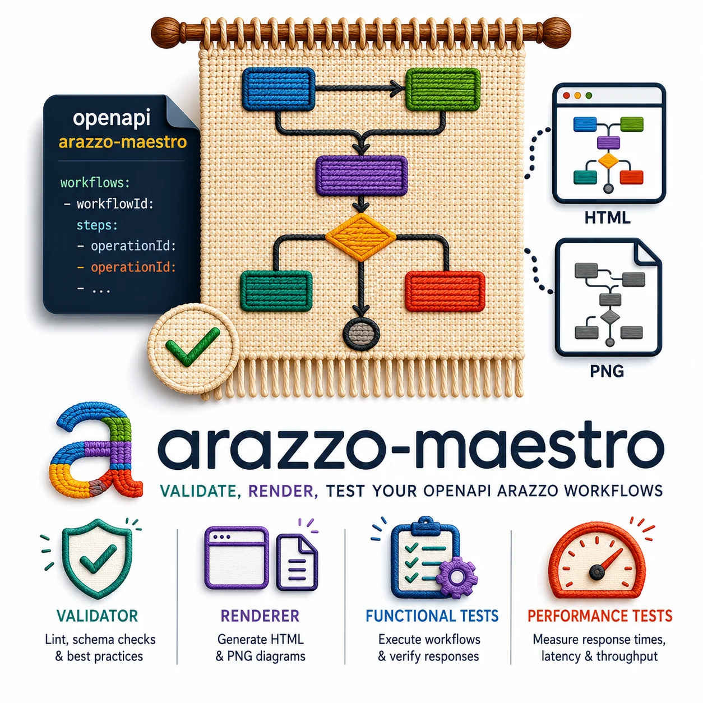
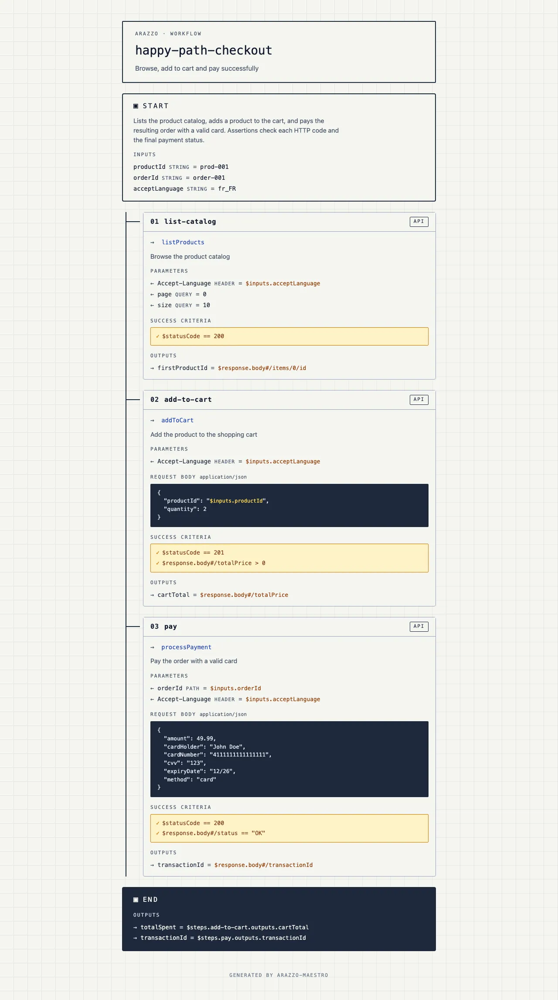
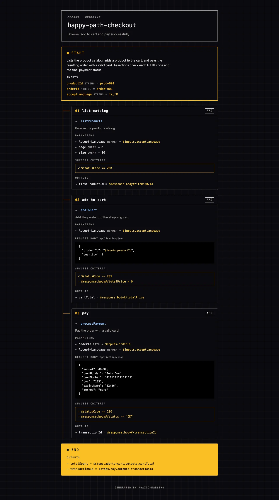

<!--
  Repo: https://github.com/emmanuelperu/arazzo-maestro

  Some badges may resolve only after one-time setup:
  - Codecov / Go Report Card: need a one-time sign-in on those services.
  - Docker image: published at `ghcr.io/emmanuelperu/arazzo-maestro:0.0.1` since the v0.0.1 release; can also be built locally via `docker build --build-arg VERSION=0.0.1 -t arazzo-maestro:0.0.1 .` (see Docker section below).
-->

<p align="center">
  
</p>

<h1 align="center">arazzo-maestro</h1>

<p align="center">
  <strong>Lint &amp; render Arazzo workflows. Single Go binary. Eco-designed. Accessible by default.</strong>
</p>

<p align="center">
  <a href="https://github.com/emmanuelperu/arazzo-maestro/actions/workflows/ci.yml"></a>
  <a href="https://codecov.io/gh/emmanuelperu/arazzo-maestro"></a>
  <a href="https://goreportcard.com/report/github.com/emmanuelperu/arazzo-maestro"></a>
  <a href="https://pkg.go.dev/github.com/emmanuelperu/arazzo-maestro"></a>
  <a href="https://github.com/emmanuelperu/arazzo-maestro/releases"></a>
  <a href="https://github.com/emmanuelperu/arazzo-maestro/pkgs/container/arazzo-maestro"></a>
</p>

<p align="center">
  <a href="https://go.dev/dl/"></a>
  <a href="./LICENSE"></a>
  <a href="https://spec.openapis.org/arazzo/latest.html"></a>
  <a href="./.agents/rules/accessibility.md"></a>
  <a href="./.agents/rules/eco-design.md"></a>
  <a href="https://www.bestpractices.dev/projects/12929"></a>
  <a href="https://scorecard.dev/viewer/?uri=github.com/emmanuelperu/arazzo-maestro"></a>
</p>

<p align="center">
  <a href="https://github.com/emmanuelperu/arazzo-maestro/stargazers"></a>
  &nbsp;
  <a href="https://github.com/emmanuelperu/arazzo-maestro/commits/main"></a>
  <a href="https://github.com/emmanuelperu/arazzo-maestro/issues"></a>
  <a href="https://github.com/emmanuelperu/arazzo-maestro/pulls"></a>
</p>

---

## What it does

`arazzo-maestro` is a CLI that turns [Arazzo](https://spec.openapis.org/arazzo/latest.html) workflow specifications into something useful for the rest of your team:

- **`lint`**: validate Arazzo files against the official JSON Schema, internal semantic rules (unique IDs, `$steps` references), and cross-file checks against the referenced OpenAPI contracts.
- **`view`**: generate a standalone HTML page per workflow, no server, no build, no JavaScript framework. Open in any browser, commit to a docs folder, ship to GitHub Pages.
- **`test`**: generate runnable tests from a workflow. End-to-end with `test gen e2e` (Hurl), or generate and run them against an endpoint with an optional HTML report (`test run e2e`); load/performance with `test gen perf` (k6).

```text
*.arazzo.yaml (Arazzo) ────┐                       ┌─►  lint   →  exit 0/1 + structured findings
                           ├──►  arazzo-maestro  ──┼─►  view   →  dist/*.html  (standalone)
*-openapi.yaml / *-api.yaml ┤                       ├─►  test e2e  →  dist/e2e/hurl/*.hurl  (+ run / HTML report)
themes.yml (opt.)        ──┘                       └─►  test perf →  dist/perf/k6/*.k6.js
```

## Why it exists

| Need | What we do | What we don't try to be |
|---|---|---|
| Validate Arazzo files in CI | ✅ Single binary, deterministic, offline. `lint` → exit code + parseable findings | An IDE plugin |
| Share workflows with non-devs | ✅ Standalone HTML, no IDE, no auth | A live editor |
| Cross-file integrity (operationId exists?) | ✅ Reads `sourceDescriptions.url`, indexes operations, validates references | A full OpenAPI validator |
| Turn a workflow into runnable tests | ✅ `test gen/run e2e` emits Hurl files (`{{baseUrl}}`, captures, asserts), runs them, writes an HTML report; `test gen perf` emits k6 scripts | A workflow runtime/orchestrator |
| Eco-designed output | ✅ 1 network request, system fonts, ~18 kB HTML | A pixel-perfect design system |
| Accessibility-first | ✅ WCAG 2.2 AA contrasts, semantic HTML, `aria-hidden` on decoratives | An a11y testing tool |

See ["What makes us different"](#what-makes-us-different) below for the longer take.

## Quick start

```bash
# Install (Go 1.25+)
go install github.com/emmanuelperu/arazzo-maestro/cmd/arazzo-maestro@latest

# Or build the Docker image locally (~19 MB FROM scratch)
docker build --build-arg VERSION=0.0.1 -t arazzo-maestro:0.0.1 .
# Mount cwd into /work AND set it as workdir, so relative paths
# (e.g. examples/shop.arazzo.yaml, dist/) resolve against your host cwd.
docker run --rm -v "$PWD":/work -w /work arazzo-maestro:0.0.1 \
  view examples/shop.arazzo.yaml

# Lint
arazzo-maestro lint examples/shop.arazzo.yaml

# Render every examples/*.arazzo.yaml in light + dark themes
make dist
open dist/shop/light/index.html
```

## Visual preview

The repo ships with two demo Arazzo files in [`examples/`](./examples):

- [`shop.arazzo.yaml`](./examples/shop.arazzo.yaml), happy-path checkout + a retry-on-failure path (showcases `onFailure: retry`). References [`shop-openapi.yaml`](./examples/shop-openapi.yaml) (scored 100/100 by [Vacuum](https://quobix.com/vacuum/)).
- [`checkout-branching.arazzo.yaml`](./examples/checkout-branching.arazzo.yaml), single payment step that branches via `onSuccess: goto` / `onFailure: goto` to a confirm or cancel step. References [`checkout-branching-api.yaml`](./examples/checkout-branching-api.yaml).

The `happy-path-checkout` workflow rendered by `view`, in the two built-in themes (click to enlarge):

| Light | Dark |
|---|---|
| [](./docs/screenshots/happy-light.webp) | [](./docs/screenshots/happy-dark.webp) |

```bash
# Render every examples/*.arazzo.yaml into dist/<workflow>/{light,dark}/
make dist
```

The Makefile iterates over `examples/*.arazzo.yaml`: adding a new file requires no change to the build command.

> 📂 **Try the HTML output locally**: `make dist` renders every example into `dist/<workflow>/{light,dark}/` (the directory is gitignored).

## Features

### 🔍 Three-pass linter

1. **JSON Schema**: embedded official OAI Arazzo schema (1.0, patched at load to accept 1.0.x **and** 1.1.x). Catches types, required fields, enums, formats, regex.
2. **Semantic rules**: uniqueness of `workflowId` / `stepId`, resolution of `$steps.X.outputs.Y` references, no forward references between steps.
3. **Cross-file**: loads each `sourceDescriptions[].url` from local disk, indexes `operationId`s, validates that every step `operationId` (short form or qualified `$sourceDescriptions.<name>.<op>`) actually points at an operation that exists. HTTP/HTTPS URLs are intentionally refused (offline-first).

```text
$ arazzo-maestro lint examples/shop.arazzo.yaml
OK: examples/shop.arazzo.yaml, no issues found

$ arazzo-maestro lint broken.yaml
[error] arazzo: value does not match expected pattern '^1\.[01]\.\d+(-.+)?$'
[error] workflows[checkout].steps[create-order].operationId:
        operation "createOrder" not found in source "shop-api"
Error: 2 issue(s) found
```

### 🎨 Themes

Two themes ship built-in (`light` default, `dark`). Both pass WCAG 2.2 AA on all critical colour pairs, verified in tests.

Customise without rebuilding by dropping a `themes.yml` at the root of your project:

```yaml
# themes.yml, change the default with one line
default: dark
```

Or override / extend:

```yaml
default: corporate

themes:
  - name: corporate
    font: serif      # sans | serif | mono (system stacks only)
    shape: square    # rounded | square
    colors:
      bg: "#fafaf7"
      cardBg: "#ffffff"
      runtime: "#7e22ce"
      # …
```

Custom themes that drop below WCAG AA contrast emit warnings at load time. See [`themes.yml.example`](./themes.yml.example) for the full template, and [`internal/theme/themes/builtin.yml`](./internal/theme/themes/builtin.yml) for the reference palette.

### 📋 Arazzo coverage

What the tool **renders and validates** versus what is currently
out of scope. The linter catches everything that fails the official
JSON Schema; the table below tracks the visual rendering.

| Arazzo feature | Render | Notes |
|---|---|---|
| `info`, `sourceDescriptions`, `workflows[]` (top-level) | ✅ | Header frame + cross-file lint |
| `workflow.inputs` (JSON-Schema properties: name, type, default) | ✅ | START block |
| `step.operationId` + `parameters` (`name`/`in`/`value`) | ✅ | Numbered `01/02/03` step boxes |
| `step.requestBody` (`contentType`, `payload` with runtime exprs) | ✅ | Dark JSON block |
| `step.successCriteria` (`condition`) | ✅ | Yellow asserts block |
| `step.outputs` | ✅ | `→ name = $expr` (ordered, spec vocabulary preserved) |
| `step.onSuccess` (`end`, `goto`) and `step.onFailure` (`end`, `goto`, `retry`) | ✅ | ✅/❌ labelled sub-sections with action tag, retry meta (`× N`, `after Nms`), `when` criteria, and clickable anchor links to target steps |
| `step.onFailure: retry` targeting self | ✅ | Plus a CSS-drawn curved arrow on the right of the step (mobile fallback: banner above the step marker) |
| `workflow.outputs` | ✅ | END block |
| Qualified `operationId` (`$sourceDescriptions.<name>.<op>`) for multi-API workflows | ✅ | Linter enforces qualification when multiple sources are declared |
| `step.workflowId` (nested workflows) | ⏭️ | Future, would extend the rendering graph |
| `step.dependsOn` (parallel branches) | ⏭️ | Future |
| `components.parameters` / `components.{success,failure}Actions` (`$ref` reuse) | ⏭️ | Future |
| `Criterion.type` (`simple`/`regex`/`jsonpath`/`xpath`) + `Criterion.context` | ⚠️ | Read by the linter, not yet surfaced in the render |
| AsyncAPI sources | ❌ | Out of scope |

### 🧪 Test generation

Turn an Arazzo workflow into a runnable test artifact, then run it against any environment. The subcommand grammar reflects what kind of test you want, and only then the target technology:

```text
arazzo-maestro test gen e2e  <file> [flags]      Write end-to-end functional tests to disk
arazzo-maestro test run e2e  <file> [flags]      Generate + run them against an endpoint
arazzo-maestro test gen perf <file> [flags]      Load / performance tests (k6)
```

The kind (`e2e` / `perf`) is a subcommand so each one declares its own flags: e2e doesn't pretend to know about virtual users, perf doesn't pretend to know about response assertions. The target technology is picked through `--format`, with a sensible default per kind. Cobra validates the combination, so `--format=drill` on `e2e` is rejected at parse time; no manual validation code.

**Available today: `e2e --format=hurl`** (default). Each workflow produces one `.hurl` file under the output directory, organised by kind / format / Arazzo source:

```bash
arazzo-maestro test gen e2e examples/shop.arazzo.yaml -o dist/
# → wrote dist/e2e/hurl/shop/happy-path-checkout.hurl
# → wrote dist/e2e/hurl/shop/payment-refused-path.hurl
```

The `e2e/<format>/<arazzo-name>/` prefix is added by the CLI so a single output directory can hold artifacts for several Arazzo files and several kinds (e2e, perf, ...) without collisions, and so the on-disk layout mirrors the subcommand grammar.

The generator delegates `operationId` resolution to the OpenAPI sources declared under `sourceDescriptions` (loaded as local files only; HTTP/HTTPS URLs are rejected, same eco-design rule as the linter). Resolved steps emit real `METHOD {{baseUrl}}/path` request lines with path parameters substituted; unresolvable steps emit a Hurl comment and a placeholder so the file stays valid for the target tool.

The request host is never hard-coded. Every request line is prefixed with the `{{baseUrl}}` Hurl variable, so the **same** `.hurl` file runs unchanged against staging, pre-production or a local mock by passing the endpoint at run time. The OpenAPI `servers:` URL, when present, is surfaced in the file header as the documented default.

Arazzo step features translated:

| Arazzo                     | Hurl                                          |
|----------------------------|-----------------------------------------------|
| request host               | `{{baseUrl}}` variable (set per environment)  |
| `parameters` in=header     | header lines on the request                   |
| `parameters` in=query      | `[QueryStringParams]` block                   |
| `parameters` in=path       | substituted into the URL template             |
| `step.outputs`             | `[Captures]` with `jsonpath` / `status`       |
| `step.successCriteria`     | comments inside `[Asserts]`                   |
| `$inputs.foo`              | `{{foo}}` (Hurl variable)                     |
| `{$inputs.foo}` embedded in text | `{{foo}}` inside the string             |
| `$steps.s.outputs.o`       | `{{s_o}}` (capture-chained)                   |
| `$response.body#/x/y`      | `jsonpath "$.x.y"`                            |
| `$statusCode`              | `status`                                      |

**Run against your environment with `test run e2e`.** It generates the tests on the fly and executes them with [Hurl](https://hurl.dev) against the endpoint you pass, optionally writing Hurl's HTML report. You choose the target at run time, so the same workflow validates staging, then pre-prod, then prod:

```bash
# Run against a pre-production endpoint
arazzo-maestro test run e2e examples/shop.arazzo.yaml \
  --base-url https://staging.shop.example.com/api/v1 \
  --variable productId=p-001 --variable orderId=ord-1 --variable acceptLanguage=en

# Same thing, plus an HTML report (Hurl's native format)
arazzo-maestro test run e2e examples/shop.arazzo.yaml \
  --base-url https://staging.shop.example.com/api/v1 \
  --report-html dist/hurl-report \
  --variable productId=p-001 --variable orderId=ord-1 --variable acceptLanguage=en
# → open dist/hurl-report/index.html
```

`--base-url` sets the `{{baseUrl}}` variable; `--variable name=value` (repeatable) supplies the workflow inputs listed in each generated file's header. The process exit status mirrors Hurl (non-zero on any failure), and with `--report-html` the report is written even when tests fail, so CI can publish it as an artifact. Hurl must be on `PATH` ([install](https://hurl.dev/docs/installation.html), e.g. `brew install hurl`); prefer `test gen e2e` when you only want the files.

**Available: `perf --format=k6`** (issue #22). Each workflow becomes one k6 script:

```bash
arazzo-maestro test gen perf shop.arazzo.yaml -o dist/ \
  --vus=10 --duration=30s \
  --threshold='http_req_duration=p(95)<500' --threshold='http_req_failed=rate<0.01'
# → wrote dist/perf/k6/shop/happy-path-checkout.k6.js
```

The load profile and thresholds are not part of Arazzo, so they come from flags and land in the script's exported `options`. Each `--threshold` is a k6 `metric=expression` (repeatable); a bare `expression` defaults the metric to `http_req_duration`. The generated script reads its target from the `BASE_URL` environment variable (default: the OpenAPI `servers:` URL) and each workflow input from a same-named variable, so the same script runs anywhere:

```bash
k6 run -e BASE_URL=https://staging.example.com -e productId=p-001 \
  dist/perf/k6/shop/happy-path-checkout.k6.js
```

Workflow steps become `http.request(...)` calls, outputs become captures (`res.json(...)`, `res.status`) chained into later steps, and status-code success criteria become `check()` predicates (other conditions are emitted as comments rather than guessed at). Runtime expressions inside a request body are substituted too (`"$inputs.productId"` becomes the `productId` constant; the e2e generator emits `{{productId}}`, unquoted when the input's declared type is numeric or boolean), as is the spec's embedded form: `"Bearer {$inputs.token}"` becomes a JS template literal in k6 and `"Bearer {{token}}"` in Hurl. Only whole-string expressions and braced `{$expr}` occurrences resolving to a declared input or earlier step output are substituted; anything else stays a literal. Drill is a planned lighter alternative.

The perf-only flags (`--vus`, `--duration`, `--threshold`) live on `test gen perf` so `test gen perf --help` documents exactly what makes sense for load testing; `test gen e2e --help` stays focused on functional concerns. Both subcommands share the same underlying workflow IR, so adding a new format is a per-template change, not a CLI redesign.

### 🌱 Eco-design and accessibility

These are **engineering constraints**, not afterthoughts. The rules are formalised in [`.agents/rules/`](./.agents/rules/) and enforced by reviews and tests:

- **Eco-design**: 1 network request at page load (Tailwind CDN), ~23 kB HTML, ~4 kB gzipped, no JavaScript, no fonts loaded from third parties, single Go binary (~19 MB) packaged in a `FROM scratch` Docker image.
- **Accessibility**: WCAG 2.2 AA contrasts (4.5:1 on body text), semantic HTML (`<main>`, `<section>`, `<h1>`→`<h2>`→`<h3>`), `aria-hidden` on decorative icons, visible focus, `prefers-reduced-motion` honoured, no info conveyed by colour alone, fluid `rem` sizing.

### 🧰 Built-in CLI

```text
arazzo-maestro --version                         Print version and exit
arazzo-maestro lint <file>                       Validate against schema + rules + cross-file
arazzo-maestro view <file> [flags]               Render to HTML
arazzo-maestro test gen e2e  <file> [flags]      Generate e2e tests (hurl)
arazzo-maestro test run e2e  <file> [flags]      Generate + run e2e tests, optional HTML report
arazzo-maestro test gen perf <file> [flags]      Generate perf tests (k6)

view flags:
  -o, --output <dir>          Output directory (default: dist)
      --workflow <id>         Only render this workflow
      --no-index              Skip generating index.html
      --theme <name>          Theme (default: light, or themes.yml's default:)
      --themes <path>         Path to a themes YAML (bypasses ./themes.yml)
      --list-themes           List available themes and exit

test gen e2e flags:
  -o, --output <dir>          Output directory (default: dist)
      --workflow <id>         Only generate this workflow
      --format <name>         Output format (default: hurl)

test run e2e flags:
      --base-url <url>        Target endpoint, e.g. https://staging.example.com/api/v1 (required)
      --report-html <dir>     Also write a Hurl HTML report to this directory
      --variable <name=value> Hurl variable for a workflow input (repeatable)
      --workflow <id>         Only run this workflow
      --format <name>         Output format (default: hurl)

test gen perf flags:
  -o, --output <dir>          Output directory (default: dist)
      --workflow <id>         Only generate this workflow
      --format <name>         Output format (default: k6)
      --vus <n>               Concurrent virtual users (default: 1)
      --duration <d>          Test duration (e.g. 30s, 5m) (default: 30s)
      --threshold <m=expr>    k6 threshold as metric=expression (repeatable)
```

## Architecture

```
internal/
├── model/         Pure data types (no behaviour)
├── parser/        YAML → model.ArazzoDocument
├── oasresolver/   Loads a local OpenAPI 3.x doc (via pb33f/libopenapi)
│                  and resolves operationIds → (Method, Path, BaseURL, Spec)
├── linter/        Validates a document, three passes:
│                  schema.go (official JSON Schema, via santhosh-tekuri/jsonschema)
│                  linter.go (uniqueness, $steps.X.outputs.Y references)
│                  crossfile.go (sourceDescriptions[].url → oasresolver, opId checks)
├── hurlgen/       model.Workflow + oasresolver → Hurl (.hurl) e2e test text
├── k6gen/         model.Workflow + oasresolver → k6 (.k6.js) perf test script
├── theme/         Loads built-in + user themes, validates, audits WCAG contrast
└── renderer/      model + theme → standalone HTML (html/template + embedded assets)
cmd/arazzo-maestro/   Cobra CLI entry point
```

Dependency graph: `model` → ∅, `parser` → `model`, `oasresolver` → `model` (external: `pb33f/libopenapi`), `linter` → `parser` + `model` + `oasresolver`, `hurlgen` → `model` + `oasresolver`, `k6gen` → `model` + `oasresolver`, `theme` → ∅, `renderer` → `model` + `theme`, `cmd` → all. No cycles.

## What makes us different

There are already Arazzo plugins for VS Code and a Node-based validator from Jentic. They solve **authoring**: autocomplete, in-IDE preview, live validation while typing. We solve everything that happens **after** authoring:

| | Editor plugins | `arazzo-maestro` |
|---|---|---|
| Validate in CI / GitHub Actions / pre-commit | ❌ | ✅ |
| Share rendering with non-devs | ❌ Needs the IDE | ✅ Standalone HTML, any browser |
| Versionable artifact (commit, deploy to Pages) | ❌ Nothing to commit | ✅ HTML files |
| Zero runtime dependency | ❌ Needs IDE | ✅ Single Go binary, `FROM scratch` Docker |
| Cross-editor (vim, emacs, Zed, Cursor…) | ❌ Lock-in | ✅ Any editor or none |
| Explicit eco-design + accessibility contract | ❌ | ✅ Enforced by rules + tests |

These are complementary. The same user can have a VS Code plugin **and** `arazzo-maestro` in their CI.

## Examples

### CI workflow (GitHub Actions)

```yaml
# .github/workflows/arazzo.yml
name: arazzo
on: [pull_request, push]

jobs:
  lint:
    runs-on: ubuntu-latest
    steps:
      - uses: actions/checkout@v4
      - uses: actions/setup-go@v5
        with: { go-version: '1.25' }
      - run: |
          go install github.com/emmanuelperu/arazzo-maestro/cmd/arazzo-maestro@latest
          arazzo-maestro lint workflows/checkout.yaml

  publish:
    needs: lint
    runs-on: ubuntu-latest
    steps:
      - uses: actions/checkout@v4
      - run: arazzo-maestro view workflows/checkout.yaml -o public/
      - uses: actions/upload-pages-artifact@v3
        with: { path: public/ }
```

### Pre-commit hook

```yaml
# .pre-commit-config.yaml
- repo: local
  hooks:
    - id: arazzo-lint
      name: arazzo-maestro lint
      entry: arazzo-maestro lint
      language: system
      files: '\.arazzo\.ya?ml$'
```

### Docker

The image at `ghcr.io/emmanuelperu/arazzo-maestro:latest` is published
once the first release is tagged (`v0.0.1`+). Until then, build it
locally from the in-repo [`Dockerfile`](./Dockerfile):

```bash
# Build locally
docker build --build-arg VERSION=0.0.1 \
  -t ghcr.io/emmanuelperu/arazzo-maestro:0.0.1 .

# Lint a file from the current directory
docker run --rm -v "$PWD":/work -w /work \
  ghcr.io/emmanuelperu/arazzo-maestro:0.0.1 \
  lint workflows/checkout.yaml

# Render to ./dist/ on the host
docker run --rm -v "$PWD":/work -w /work \
  ghcr.io/emmanuelperu/arazzo-maestro:0.0.1 \
  view workflows/checkout.yaml
```

`-v "$PWD":/work` exposes your current directory inside the container,
and `-w /work` makes it the working directory, so relative paths
(input file, `-o dist/` default) resolve where you expect on the host.
Without `-w`, the container's cwd is `/` and `view`'s default output
(`./dist/`) is written to `/dist/` inside the container, then discarded
by `--rm`.

The image is `FROM scratch` (~19 MB): no shell, no libc, no package
manager. The binary is the entire userland.

## Roadmap

- [x] Bootstrap, parser, renderer, CLI
- [x] Theme system (light/dark + user `themes.yml` + WCAG audit)
- [x] Linter: JSON Schema + semantic rules + cross-file resolution
- [x] Visual identity: "Blueprint" (faint grid, navy + amber accent, schematic frames)
- [x] `onSuccess` / `onFailure` (incl. `retry` with `retryAfter` / `retryLimit`)
- [x] Retry-self CSS curved arrow, mobile fallback, anchor links on goto targets
- [x] `Makefile` + `examples/*.arazzo.yaml` convention (glob auto-pickup)
- [x] Step sub-section labels aligned to Arazzo spec vocabulary (`Parameters` / `Request Body` / `Success Criteria` / `Outputs`)
- [x] Second worked example: `checkout-branching.arazzo.yaml` with `goto` branching
- [x] OpenSSF Phase 1: CI (test + vet + golangci-lint + govulncheck), Scorecard, Dependabot, `SECURITY.md`, `CONTRIBUTING.md`
- [x] `Dockerfile` (`FROM scratch`, ~5 MB) with `VERSION` build-arg
- [x] OpenSSF Phase 2: `goreleaser` (multi-OS binaries + Docker image), cosign-signed releases, first tag `v0.0.1`
- [x] OpenSSF Phase 3: actions pinned to commit SHAs, CodeQL SAST workflow, `FuzzParseBytes` for the parser, `repo_token` plumbed for a `SCORECARD_TOKEN` PAT (unlocks Branch-Protection check once the secret is set)
- [x] OpenAPI source parsing via `pb33f/libopenapi` (`internal/oasresolver`, replaces the hand-rolled YAML walk)
- [x] `test gen e2e` / `test run e2e`: Hurl generation, runner with `--base-url`, `--variable`, optional HTML report
- [x] `test gen perf`: k6 script generation with `--vus` / `--duration` / `--threshold`, runtime expressions substituted in request bodies
- [ ] Reach OpenSSF Best Practices `passing` badge ([project 12929](https://www.bestpractices.dev/projects/12929), currently `in_progress`)
- [ ] Shrink the binary (~5 MB before libopenapi, ~19 MB after: its `index` package links the whole `net/http`/TLS stack for remote `$ref` support we deliberately refuse)
- [ ] Nested workflows (`step.workflowId`)
- [ ] `step.dependsOn` parallel branches
- [ ] `components.{parameters,successActions,failureActions}` `$ref` reuse
- [ ] `Criterion.type` + `context` surfaced in the render
- [ ] PNG export via headless Chromium
- [ ] Internalise Tailwind CSS (zero network requests at page load)
- [ ] HTTPS source URLs with deterministic caching (opt-in)
- [ ] Watch mode (`--watch`) using `fsnotify`

## Documentation

- [`AGENTS.md`](./AGENTS.md), entry point for any coding agent (humans too) working on this repo
- [`CONTRIBUTING.md`](./CONTRIBUTING.md), dev environment + PR checklist + conventions
- [`SECURITY.md`](./SECURITY.md), vulnerability reporting policy (private GitHub Security Advisories)
- [`Plan.md`](./Plan.md), full project history, decisions, roadmap, feature designs
- [`.agents/rules/`](./.agents/rules/), eco-design, accessibility, and code-style rules
- [`themes.yml.example`](./themes.yml.example), annotated theme template
- [`examples/`](./examples/), `*.arazzo.yaml` (Arazzo files, picked up by `make dist` / `make lint`) + their referenced OpenAPI contracts
- [`Makefile`](./Makefile), the canonical `make help|build|test|vet|lint|dist|clean` targets
- [`Dockerfile`](./Dockerfile), multi-stage `FROM scratch` build, accepts `--build-arg VERSION=…`

## Metrics

| Metric | Value |
|---|---|
| Generated HTML (`happy-path-checkout.html`) | ~23 kB raw, ~4 kB gzipped |
| Network requests at page load | 1 (Tailwind CDN, to be internalised) |
| Binary size (`-s -w -trimpath`) | ~19 MB |
| Docker image (`FROM scratch`) | ~19 MB |
| Direct dependencies | 4 (`cobra`, `yaml.v3`, `jsonschema`, `libopenapi`) |
| Lines of Go (excl. tests) | ~3,800 |
| Test coverage | parser 82 %, linter 84 %, oasresolver 100 %, hurlgen 100 %, k6gen 100 %, theme 86 %, renderer 81 %, cmd 76 % |
| Built-in themes WCAG AA conformance | 100 % on critical pairs (11/11, incl. `jsonRuntime` on `jsonBg`) |

## Feedback

Found a bug, or have an idea to improve the tool? Your feedback is welcome:

- **Bug reports and feature requests**: [open an issue](https://github.com/emmanuelperu/arazzo-maestro/issues). Please describe what you expected, what happened, and the `arazzo-maestro` version where relevant.
- **Security vulnerabilities**: do not open a public issue. Follow the private disclosure process in [`SECURITY.md`](./SECURITY.md).

## Contributing

PRs welcome. See [`CONTRIBUTING.md`](./CONTRIBUTING.md) for the full
guide (dev environment, PR checklist, conventions). The short version:

1. Read [`AGENTS.md`](./AGENTS.md) and the rules in [`.agents/rules/`](./.agents/rules/).
2. `make test vet`: both must be clean.
3. `make lint`: every `examples/*.arazzo.yaml` must lint with no issues.
4. `make dist`: every example must render without errors.
5. If you touch the HTML output, attach the gzipped byte count of an `examples/*.arazzo.yaml` rendering to the PR. Regressions > 10 % require discussion.

## Security

Please **do not** open public issues for security reports. See
[`SECURITY.md`](./SECURITY.md) for the supported channels and our
coordinated disclosure timeline.

## License

[Apache 2.0](./LICENSE). Compatible with enterprise legal review; patent grant included.

## Acknowledgements

- The [OpenAPI Initiative](https://www.openapis.org/) for the Arazzo specification.
- [`santhosh-tekuri/jsonschema`](https://github.com/santhosh-tekuri/jsonschema), the JSON Schema validator powering the linter's first pass.
- [`pb33f/libopenapi`](https://github.com/pb33f/libopenapi), the OpenAPI 3.x parser behind `oasresolver`.
- [Hurl](https://hurl.dev) and [k6](https://k6.io), the runners targeted by the test generators.
- [Cobra](https://github.com/spf13/cobra), CLI framework.
- [`yaml.v3`](https://gopkg.in/yaml.v3), YAML parsing with node-level access.
- The [WebAIM](https://webaim.org/) contrast checker, the reference we test against.
